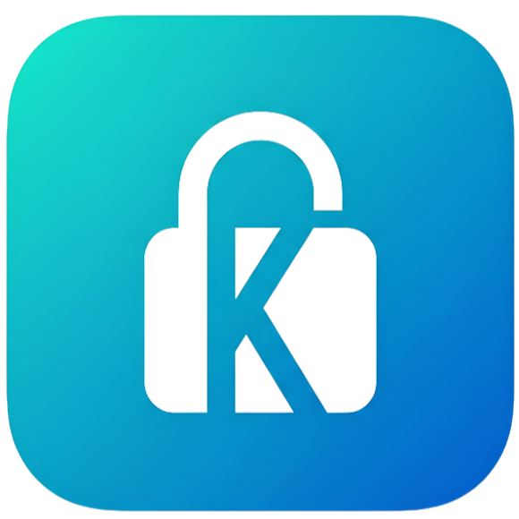

# KPass

<p align="center">
  
</p>

A KDE desktop client for `.kdbx` (KeePass) password databases.

## Features

- Open and unlock `.kdbx` databases with a master password
- Browse entries by group with search (title and username)
- Copy username or password to clipboard with one click
- View full entry details (title, username, password, URL, notes)
- Add entries and save the database
- Recent files list on the splash screen

## Requirements

- Linux with KDE Plasma (Wayland or X11)
- [Devbox](https://www.jetpack.io/devbox) — provides Qt 6.9, Kirigami, and all build dependencies in an isolated environment
- [direnv](https://direnv.net/) — activates the devbox environment automatically on `cd` (see `.envrc`)

## Run

```bash
make run        # generates moc output if needed, then runs go run .
```

The app must be launched from the project root so `qml/Main.qml` resolves.

`QT_QUICK_BACKEND=software` is set by default so the app works without a full GLX stack. Set `QT_QUICK_BACKEND=basic` to try GPU rendering.

## Build

```bash
make build      # outputs ./kpass
```

## Flatpak

```bash
make flatpak          # install SDK/runtime, vendor Go deps, build, install
make flatpak-run      # launch com.benjih.KPass
make flatpak-rebuild  # clean build dir and do a full rebuild
```

Manifest: `flatpak/com.benjih.KPass.yaml` (KDE Platform 6.10).

## Architecture

KPass uses [miqt](https://github.com/mappu/miqt) to embed Qt 6 / QML in Go, and [gokeepasslib](https://github.com/tobischo/gokeepasslib) for `.kdbx` I/O. Because miqt cannot expose new `Q_INVOKABLE` methods from Go alone, a thin C++ `DatabaseManager` QObject (`bridge/`) acts as the bridge between QML and Go via cgo.

```
internal/keepass/   KeePass open/save/traverse logic (Go)
bridge/             C++ QObject + cgo exports for QML
qml/                Qt Quick Controls / Kirigami UI
main.go             Application entry
```

`bridge/moc_databasemanager.cpp` is generated by Qt's `moc` tool and gitignored. It is regenerated automatically by `make run` and `make build` whenever `bridge/databasemanager.h` changes.

## Development Notes

**Qt version pinning** — Devbox pins Kirigami, Breeze icons, and the Breeze QQC2 style to **6.18.0**, which pulls in Qt **6.9**. Do not add `qt6.full` or a separate Qt pin — mismatched Qt libraries will cause "incompatible Qt library" errors from KDE QML plugins.

After changing any Qt-related devbox packages, run:

```bash
go clean -cache && make build
```

User-visible strings use the `Tr` QML singleton (`Tr.i18n`) rather than KI18n.
